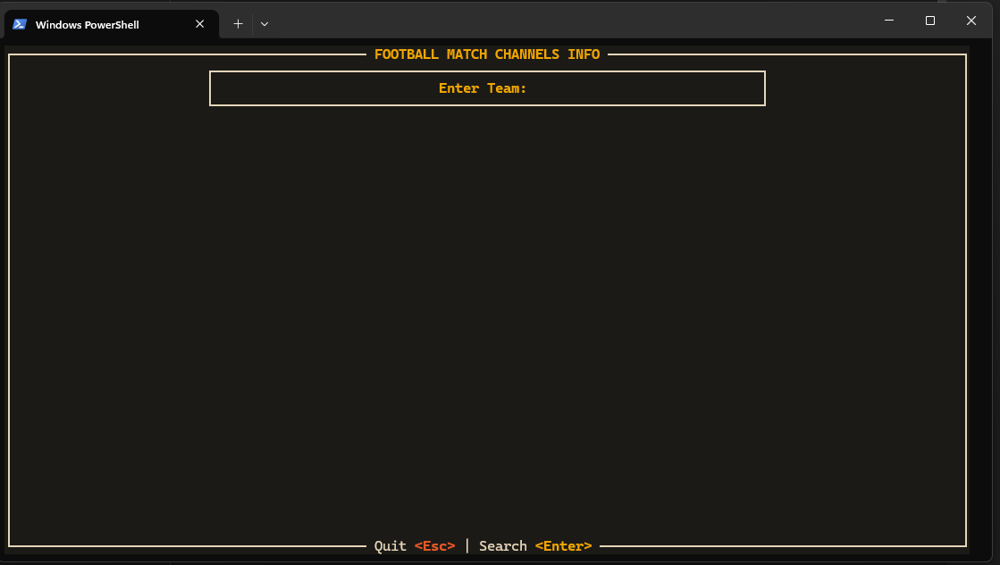

# ⚽ Foot Info - Football Match Scraper TUI

**Foot Info** is a fast, asynchronous Terminal User Interface (TUI) application built in Rust. It allows you to check upcoming TV schedules and match fixtures for your favorite football teams directly from the command line.



## 📸 Screenshots

| Startup Screen | Search Results |
|:---:|:---:|
|  |  |

## 🚀 Features

*   **Real-time Scraping**: Fetches live data from [WherestheMatch.com](https://www.wheresthematch.com).
*   **TV Channels**: Shows which UK TV channels are broadcasting the match.
*   **Local Time Conversion**: Automatically converts match kickoff times to your local system time.
*   **Smart Error Handling**: Distinguishes between incorrect team names and teams with no scheduled matches.
*   **Beautiful TUI**: Built with `ratatui` featuring a custom "Fall" color theme.

## 🛠️ Tech Stack

*   **Language**: Rust
*   **TUI Framework**: [Ratatui](https://github.com/ratatui-org/ratatui)
*   **Async Runtime**: [Tokio](https://tokio.rs/)
*   **HTTP Client**: [Reqwest](https://github.com/seanmonstar/reqwest)
*   **HTML Parsing**: [Scraper](https://github.com/causal-agent/scraper)
*   **Error Handling**: [Thiserror](https://github.com/dtolnay/thiserror)

## 📦 Installation

Ensure you have Rust and Cargo installed. If not, get them from [rustup.rs](https://rustup.rs/).

```bash
git clone https://github.com/your-username/foot-info.git
cd foot-info
cargo build --release
```

## 🎮 Usage

Run the application using Cargo:

```bash
cargo run
```

### Controls

*   **Type to Search**: Enter the name of a football team (e.g., `Manchester United`, `Arsenal`, `Real Madrid`).
*   **`<Enter>`**: Submit the search.
*   **`<Esc>`**: Quit the application.

## 📂 Project Structure

*   `src/main.rs`: Application entry point and runtime setup.
*   `src/app.rs`: State management and event loop.
*   `src/ui.rs`: Rendering logic and widget layout.
*   `src/client.rs`: Scraping engine and HTML parsing.
*   `src/user.rs`: Utilities for timezone conversion.
*   `src/theme.rs`: Color palette definitions.

## 📝 License

This project is licensed under the MIT License - see the [LICENSE](LICENSE) file for details.

## ⚠️ Disclaimer

This tool is for educational purposes. Data is scraped from [WherestheMatch.com](https://www.wheresthematch.com). Please respect their terms of service and usage policies.