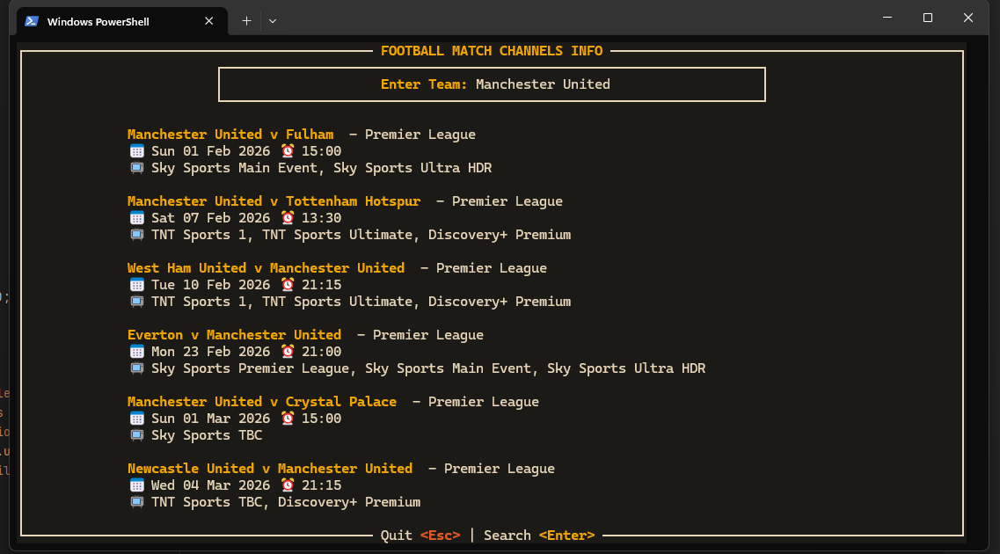
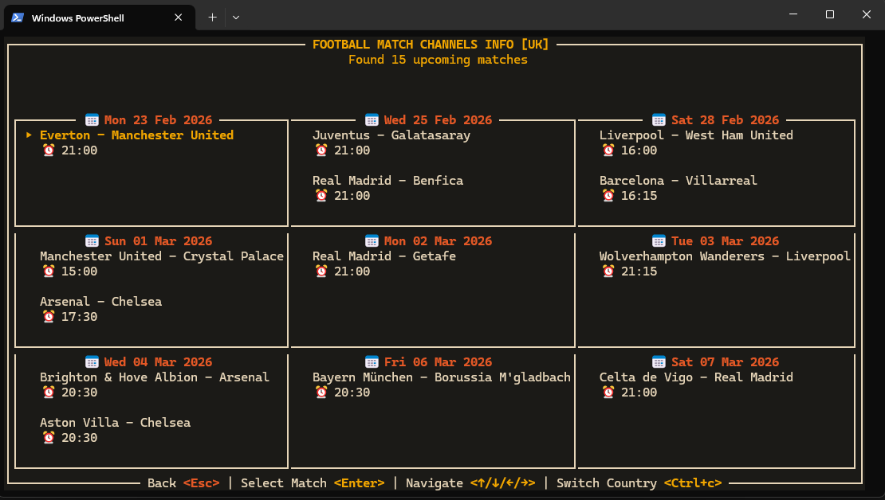
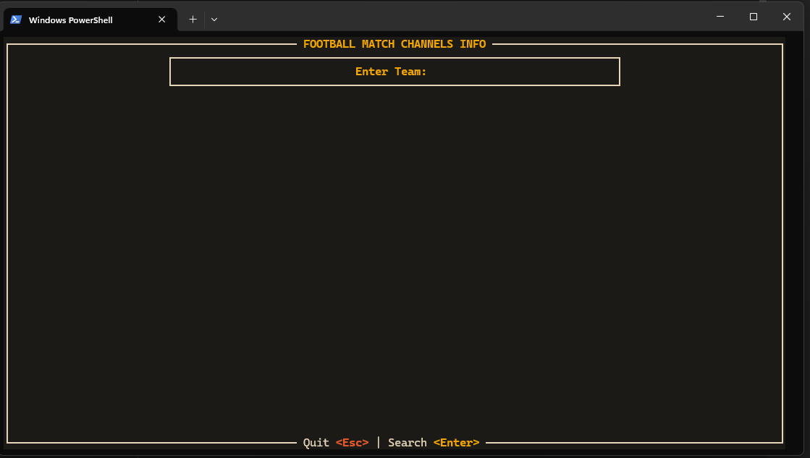

# ⚽ Foot Info - Football Match Scraper

**Foot Info** is a fast, asynchronous football TV schedule tracker with both a **Terminal UI** (Rust TUI) and a **Mobile App** (Flutter/Android). Search for your team and instantly see upcoming match fixtures and their broadcast channels, with support for UK, US, and FR regions.



## 📸 Screenshots

| Top Matches | Startup Screen |
|:---:|:---:|
|  |  |

---

## 🚀 Features

- **Multi-Region Support**: Switch between **UK 🇬🇧**, **US 🇺🇸**, and **FR 🇫🇷** data sources.
- **Real-time Scraping**: Fetches live data using Chrome emulation to bypass Cloudflare:
  - 🇬🇧 [WherestheMatch.com](https://www.wheresthematch.com)
  - 🇺🇸 [WorldSoccerTalk.com](https://worldsoccertalk.com)
  - 🇫🇷 [Matchs.tv](https://matchs.tv)
- **Upcoming Top Matches**: Pulls featured fixtures from [LiveSoccerTV.com](https://www.livesoccertv.com/schedules/).
- **Favorite Team Persistence**: Save your favorite team for instant access.
- **Local Time Conversion**: Converts kickoff times from UTC/ET/Paris to your local timezone.

---

## 📂 Project Structure

```
foot-info/
├── core/                   # Rust library crate — pure domain logic, no UI
│   ├── src/
│   │   ├── client.rs       # FootballClient: orchestrates providers (FFI-ready)
│   │   ├── models.rs       # Match, TopMatch, Country
│   │   ├── error.rs        # AppError enum
│   │   ├── providers/      # Strategy pattern — one impl per data source
│   │   │   ├── wheresthematch.rs
│   │   │   ├── worldsoccertalk.rs
│   │   │   ├── matchstv.rs
│   │   │   └── livesoccertv.rs
│   │   └── utils/
│   │       └── time.rs     # Timezone conversion helpers
│   └── tests/              # Offline HTML parsing integration tests
│       └── resources/      # Saved HTML fixtures for tests
│
├── tui/                    # Rust binary crate — Ratatui terminal interface
│   ├── src/
│   │   ├── main.rs         # Entry point, Tokio runtime setup
│   │   ├── app.rs          # Async run loop, event dispatch
│   │   ├── state.rs        # AppState struct
│   │   ├── config.rs       # Favorite team persistence (serde + config dir)
│   │   ├── models.rs       # ViewMode enum (Search, TopMatches)
│   │   ├── handlers/       # Keybinding handlers per view mode
│   │   └── ui/             # Ratatui rendering components
│   │       ├── theme.rs
│   │       ├── layout.rs
│   │       ├── components/
│   │       └── views/
│   └── tests/              # TUI state and handler integration tests
│
└── app/                    # Flutter Android/iOS app
    ├── lib/                # Dart UI layer
    │   ├── main.dart       # App bootstrap + RustLib.init()
    │   ├── router.dart     # go_router: /top-matches, /search, /settings
    │   ├── theme.dart      # Shared color palette + GoogleFonts.inter
    │   ├── pages/          # Top matches, Search, Settings screens
    │   ├── components/     # Reusable widgets
    │   └── providers/      # Riverpod state (search, top-matches, settings)
    ├── rust/               # Flutter Rust Bridge FFI layer
    │   └── src/api/simple.rs  # search_team(), fetch_top_matches()
    └── rust_builder/       # Cargokit build integration (patched for Windows)
```

---

## 🖥️ Terminal App (TUI)

### Installation

Requires [Rust + Cargo](https://rustup.rs/).

```bash
git clone https://github.com/your-username/foot-info.git
cd foot-info
cargo build --release
```

### Usage

```bash
cargo run
```

### Controls

| Key | Action |
| :--- | :--- |
| Type | Enter a team name |
| `<Enter>` | Submit search |
| `<c>` | Cycle region (UK → US → FR) |
| `<Tab>` | Switch to Top Matches view |
| `<Ctrl+s>` | Save current team as favorite |
| `<Ctrl+f>` | Load and search for favorite team |
| `↑ / ↓` | Navigate results |
| `<Esc>` | Quit |

---

## 📱 Android App

The Flutter app wraps the same `core` Rust library via [flutter_rust_bridge](https://github.com/fzyzcjy/flutter_rust_bridge), giving you the full match schedule experience on Android.

### Requirements

- [Flutter SDK](https://flutter.dev/docs/get-started/install) ≥ 3.x
- Android SDK with NDK (install via Android Studio → SDK Manager → SDK Tools → NDK)
- [Rust + rustup](https://rustup.rs/) (must be `rustup`-based, **not** the standalone MSI)

### Installation & Running

```bash
cd app
flutter pub get
flutter run
```

To build a release APK:

```bash
flutter build apk --release
```

The compiled APK is output to `app/build/app/outputs/flutter-apk/`.

### Features

- **Top Matches tab**: Upcoming featured fixtures from LiveSoccerTV — tap any match to jump straight to its TV schedule.
- **Search tab**: Search any team and select your region (UK/US/FR).
- **Settings tab**: Set a default region and save your favorite team.

### Windows Build Notes

Building the Android native library from **Windows** requires extra prerequisites. See [GEMINI.md §9](GEMINI.md) for the full setup guide including NASM, Ninja, rustup, and the patched `android_environment.dart` in `app/rust_builder/cargokit/`.

> **TL;DR for Windows:**
> ```powershell
> winget install NASM.NASM
> winget install Ninja-build.Ninja
> # then restart your terminal/IDE
> rustup target add aarch64-linux-android armv7-linux-androideabi x86_64-linux-android i686-linux-android
> ```

---

## 🛠️ Tech Stack

| Layer | Technology |
| :--- | :--- |
| Core logic | Rust, Tokio, Wreq, Scraper, Chrono |
| Terminal UI | Ratatui, Crossterm |
| Mobile UI | Flutter, Riverpod, go_router |
| FFI bridge | flutter_rust_bridge |
| HTML parsing | Scraper (CSS selectors) |
| Config | Serde + system config dir (TUI) / SharedPreferences (Flutter) |

---

## 📝 License

This project is licensed under the MIT License — see [LICENSE](LICENSE) for details.

## ⚠️ Disclaimer

This tool is for educational purposes. Data is scraped from third-party websites. Please respect their terms of service.